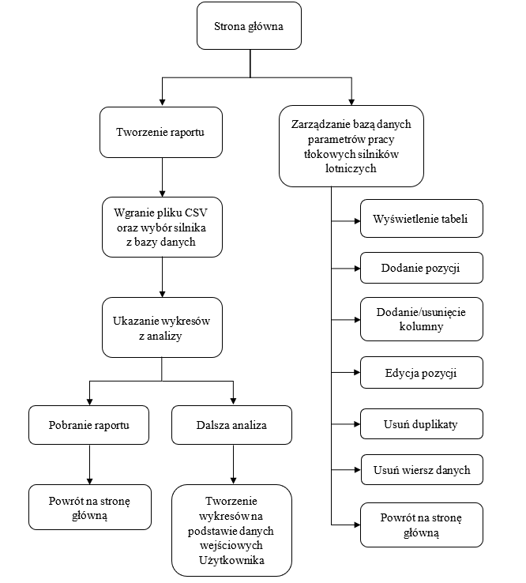
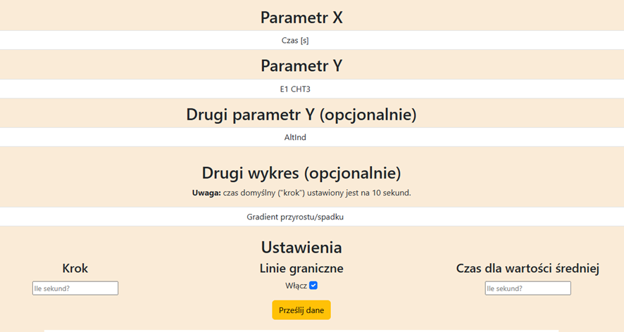

# Niniejszy dokument stanowi instrukcję użytkowania  aplikacji
## ⚠WAŻNE:⚠
Przed pobraniem kodu źródłowego z repozytorium, należy zainstalować wersję *Python*'a: 3.13.1 na komputer Użytkownika 
Link do pobrania: https://www.python.org/downloads/release/python-3131/  
**Następnie** w wierszu poleceń wymagane jest wpisanie komendy: 
 pip install -r requirements.txt  pozwala ona na zainstalowanie wszystkich niezbędnych bibliotek potrzebnych do prawidłowego działania aplikacji
## Informacje o pliku CSV
### Składnia
Nazwa kolumny - dowolna, lecz aby automatyka działała poprawnie, muszą znaleźć się kolumny "egt", "cht" czy choćby "Lcl Time".  
Istnieje opcja domyślnego wykorzystania jednostek SI, lecz trzeba wczytać się w dokumentację  i posprawdzać, na jakich ustawieniach program obecnie pracuje 
(**OBECNIE:** *zamiana z układu imperialnego na układ SI*)

## Informacja o bazie danych
Baza danych jest bazą relacyjną, napisaną za pomocą języka *SQL* (nazwa samej tabeli roboczej - "engpdb"; wykorzystana jest biblioteka zaimplementowana domyślnie wraz z językiem *Python*), zawierająca 7 kolumn parametrów maksyalnych (chyba że wskazano inaczej):

- kolumna: 'eng_name' - zawiera nazwy robocze silników, typ danych: char(32)
- kolumna: 'typ' - informacja o typie (benzynowy czy z zapłonem samoczynnym) typ danych: char(32)
- kolumna: 'TOil' - temperatura oleju, typ danych: REAL
- kolumna: 'egt' - temperatura głowicy cylindra typ danych: REAL
- kolumna: 'cht' - temperatura gazów wylotowych, typ danych: REAL
- kolumna: 'oil_press_l' - **minimalne** ciśnienie oleju, typ danych: REAL
- kolumna: 'oil_press_h' - maksymalne ciśnienie oleju, typ danych: REAL.
  
Typ danych "REAL" odnosi się do liczb zmiennoprzecinkowych, natomiast "char(32)" to komórka pozwalająca na zapis do 32 znaków różnych (**WAŻNE**: zamiast spacji należy wykorzystywać znak "_")

## Wersje języka i użytych bibliotek 
Informacje na dzień 10.08.2025
- Python: 3.13.1;
- Flask: 3.1.0;
- matplotlib: 3.10.0;
- pandas: 2.2.3;
- reportlab: 4.4.1;
- numpy: 2.2.1;
- SQlite3: >= 3.15.2;

## Uruchomienie aplikacji
Aby uruchomić aplikację, należy uruchomić plik wykonawczy run.py , następnie aplikacja samoistnie otworzy odpowiednie okno w przeglądarce.  
Niniejszy schemat przedstawia wszystkie dostępne obecnie funkcjonalności aplikacji

##  Informacja o generowaniu wykresów własnych

Program umożliwia tworzenie wykresów dodatkowych z wgranego wcześniej pliku CSV, które to są oparte o dane wejściowe zadane przez Użytkownika. Powyższe zdjęcie przedstawia wybór opcji oraz ustawień, które należy wybrać, aby zostały wygenerowane dodatkowe wykresy. Parametr „X” to atrybut, którego wartości będą znajdowały się na osi odciętych (OX), natomiast wartości parametru „Y” należeć będą do osi rzędnych (OY). W razie potrzeby można utworzyć drugą linię danych (która jako oś odciętych, wykorzystywać będzie wartości z wybranego już „X”), w takim przypadku należy zaznaczyć wybrany parametr w polu „Drugi parametr Y (opcjonalnie)”; jego wartości zostaną przedstawione na osi pomocniczej po prawej stronie wykresu.
 

Do dyspozycji jest również opcja wygenerowania drugiego dodatkowego wykresu, który będzie stworzony na podstawie danych zawartych w wcześniejszym formularzu, wykresy te są to (w wersji 1.0): gradient przyrostu/spadku wybranego parametru temperatury (w odstępie próbkowania – „kroku” – co 10 s) i wartość średnia w ustalonym przedziale czasowym (domyślnie 60 s).

Wartości widoczne w polu „Ustawienia” nie muszą być zmieniane, gdyż dotyczą one ustawień wykresu dodatkowego, w zależności od wybranego przez Użytkownika. Natomiast niezależnie od chęci generowania drugiego wykresu, ustawienie „Linie graniczne” działać będzie dla wszystkich wykresów, zatem i dla tego, tworzonego z parametrów wybranych w formularzu tworzenia. Zauważyć należy, że opcja pobiera informacje o wartościach granicznych/maksymalnych z bazy danych parametrów tych wartości dla danego silnika

